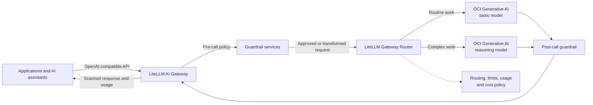

# OCI Generative AI Gateway Reference Architecture with LiteLLM

Use **OCI Generative AI** and the **LiteLLM AI Gateway** together to give
applications one governed, OpenAI-compatible entry point to multiple generative
AI models. This reference architecture adds model-tier routing, usage visibility,
OCI workload identity, and a pluggable guardrail layer. A self-hosted Presidio
service demonstrates how organizations can inspect and transform sensitive text
before and after model inference.

## Executive summary

Organizations often need more than direct access to a model API. They need a
stable application interface, approved model choices, cost controls, workload
identity, guardrails, and a path from evaluation to shared enterprise service.
This project shows one practical way to build that control point on OCI.

LiteLLM provides the gateway and intelligent routing layer. OCI Generative AI
provides managed access to the selected models, OCI IAM authorization, regional
service endpoints, and tenancy billing. Guardrail services sit in the request
and response path so the same policy applies regardless of which model LiteLLM
selects. The included configuration exposes a lower-cost `basic` route and a
frontier `reasoning` route through one API.

The deployment is deliberately small: OCI Resource Manager creates a single
Compute VM that runs LiteLLM and Presidio. It is a working reference that teams
can evaluate quickly, understand, and extend into a production platform with
their own networking, identity, availability, observability, guardrail, and
data-governance requirements.

## TL;DR

- **One AI endpoint:** applications call the LiteLLM Gateway using a familiar
  OpenAI-compatible API while OCI Generative AI serves the configured models.
- **Purposeful model choice:** routine work goes to `basic`; difficult work can
  use `reasoning`. LiteLLM can expand this pattern with additional deployments,
  routing strategies, fallbacks, and optional automatic tier selection.
- **A common guardrail path:** the included Presidio service masks recognized
  sensitive values before inference and scans the model answer before release.
  The same pattern can host other customer-approved policy services.
- **Layered cost control:** the reference caps output and concurrency, disables
  retries and caching, and returns usage. A stateful LiteLLM deployment can add
  virtual keys, budgets, rate limits, and centralized spend tracking.
- **OCI-native access:** the VM uses an instance principal and a narrowly scoped
  IAM policy, so no OCI user signing key is placed in the application.
- **Deployable now:** the package includes Terraform, the Resource Manager form,
  application source, bootstrap automation, tests, and examples.

<!-- DEPLOY_BUTTON_START -->
[](https://cloud.oracle.com/resourcemanager/stacks/create?zipUrl=https%3A%2F%2Fgithub.com%2Foracle-samples%2Foci-healthcare-naci%2Freleases%2Fdownload%2Flatest%2Foci-genai-phi-stack.zip)
<!-- DEPLOY_BUTTON_END -->

## Key benefits for organizations

| Benefit | What the architecture provides |
|---|---|
| Consistent application integration | One OpenAI-compatible endpoint and stable model aliases shield applications from provider-specific request details. |
| Choice without unmanaged sprawl | Teams can publish approved OCI Generative AI models behind logical groups such as `basic` and `reasoning`. |
| Better cost decisions | Applications can prefer an economical model, reserve frontier models for complex work, limit output, and use returned usage data for reporting. |
| Central policy enforcement | Guardrails run at the gateway boundary, giving every connected application the same request and response checks. |
| OCI identity and governance | Instance principals, compartments, IAM policies, Resource Manager, and OCI billing place model access in the customer's cloud operating model. |
| Faster evaluation | One deployment creates the network, VM, workload identity, Gateway Router, guardrail service, and working examples. |
| Clear production path | The design can grow into multiple Gateway workers, private networking, database-backed LiteLLM budgets, customer identity, and several guardrail services. |

## Reference architecture



The deployed path is:

1. A client sends a text chat request to LiteLLM and selects `basic` or
   `reasoning`.
2. LiteLLM invokes the default-on guardrail. Presidio analyzes the text and
   replaces recognized entities with typed placeholders.
3. The Gateway Router selects the OCI deployment in the requested model group.
4. LiteLLM signs the OCI Generative AI request with the VM instance principal.
5. The answer passes through the output guardrail, and the gateway returns the
   scanned text plus provider usage data.

The gateway and guardrail are separate services. This keeps the routing layer
independent of a specific detector and gives customers a clear integration point
for DLP, content safety, prompt-injection checks, allow/deny policy, schema
validation, or domain-specific review services.

For a component-level view and production extension patterns, see the
[reference architecture guide](docs/reference-architecture.md).

## Why OCI Generative AI with LiteLLM

OCI Generative AI gives customers managed model access through OCI endpoints and
authorization. LiteLLM adds an application-facing control plane across those
models. Together they separate application integration from model selection:

- **Applications** use one API and logical model names.
- **LiteLLM** applies policy, invokes guardrails, routes requests, normalizes
  responses, and exposes usage.
- **OCI IAM** determines which workload can use Generative AI in which
  compartment.
- **OCI Generative AI** serves the selected on-demand model and bills the
  tenancy.
- **[OCI Cost Analysis](https://docs.oracle.com/en-us/iaas/Content/Billing/Concepts/costanalysisoverview.htm)
  and [Budgets](https://docs.oracle.com/en-us/iaas/Content/Billing/Concepts/budgetsoverview.htm)**
  provide cloud-level reporting and alerting alongside gateway-level controls.

The reference uses an exact-instance dynamic group and the `generative-ai-chat`
permission. The workload does not store an OCI user API key. Resource Manager
makes the infrastructure repeatable, and customers can change the models,
Generative AI region, VM size, and compartments through the deployment form.

Model hosting and processing location still depend on the selected OCI offering.
The default Google and xAI models are identified by Oracle as externally hosted.
Review [OCI model locations](https://docs.oracle.com/en-us/iaas/Content/generative-ai/model-endpoint-regions.htm),
terms, regional availability, and [current pricing](https://www.oracle.com/cloud/price-list/)
for each workload. OCI-hosted alternatives can be configured when they are
available for the required region and serving mode.

## LiteLLM intelligent routing

The API names `basic` and `reasoning` are real LiteLLM Router model groups in
[`gateway/config.yaml`](gateway/config.yaml). The reference requires callers to
name a group so a missing field cannot spend against an unintended tier.

| Model group | Default OCI model | Recommended use |
|---|---|---|
| `basic` | `google.gemini-2.5-flash-lite` | Summarization, extraction, classification, and routine text work |
| `reasoning` | `xai.grok-4.3` | Complex analysis where the added model capability justifies the cost |

Each group contains one OCI deployment in this small example. With multiple
approved deployments in a group, LiteLLM Router can select among them using
strategies such as shuffle, least busy, usage based, latency based, or configured
cost. Pre-call checks, cooldowns, fallbacks, and session affinity can support a
more resilient shared gateway.

LiteLLM also offers an optional Auto Router that classifies requests into model
tiers. This reference keeps the choice visible while customers evaluate routing
quality, false escalation, processing boundaries, and savings. The included
[`cost_controlled_chat.py`](examples/cost_controlled_chat.py) demonstrates a
transparent application policy: prefer `basic`, escalate using visible rules,
cap daily reasoning calls, and keep only aggregate counters.

## Cost controls and tracking

Cost management works best as several coordinated layers:

| Layer | Capability in this reference | Production extension |
|---|---|---|
| Application | Defaults to `basic` in the example policy and requires explicit escalation | Business-specific routing rules, approvals, and per-workflow limits |
| LiteLLM request controls | Output caps, four concurrent requests, no queue, no automatic retries, and no response cache | Per-model RPM/TPM, fallback policy, and shared concurrency controls |
| LiteLLM usage | Provider usage is returned to the caller; the example records aggregate call and token counts | PostgreSQL-backed spend records, dashboards, virtual keys, team/customer attribution, and budgets |
| OCI | Generative AI inference and infrastructure appear in OCI billing | OCI Cost Analysis, tags, compartment reporting, and Budget alerts |

The database-free reference does not claim to enforce a shared dollar budget.
Authoritative LiteLLM budgets and multi-user spend tracking require a stateful
Gateway design, normally PostgreSQL and Redis for shared workers and counters.
Feature and license requirements should be checked for the selected LiteLLM
version.

OCI documents on-demand chat charges in characters for these offerings, while
LiteLLM usage is commonly represented in tokens. Use the OCI bill as the source
of truth for invoiced cost. Configure model prices in LiteLLM when using its
cost-based routing or spend reports, and reconcile those estimates with OCI.
OCI Budgets are periodic alerts rather than a real-time inference cutoff.

See [LiteLLM routing and cost controls](docs/litellm-routing-and-cost.md) for
configuration options and implementation references.

## Guardrail services and Presidio

Guardrails are a service boundary in this architecture. LiteLLM invokes them
before routing and after model execution, allowing one policy to cover every
approved model. A customer can run one guardrail or compose several checks based
on the workload.

This project includes **[Microsoft Presidio](https://github.com/microsoft/presidio)**
as a concrete, open-source example.
The service recognizes common entities such as names, dates, locations, phone
numbers, email addresses, and other identifiers. Example recognizers also show
how to detect labeled record, patient, account, and date-of-birth formats.
Recognized values become typed placeholders such as `<PERSON>` or `<MRN>`; the
reference retains no reversible mapping.

The LiteLLM `presidio-phi` guardrail is default-on and configured for both input
and output. A guardrail timeout, malformed response, or service failure stops the
call. Presidio remains on an internal Docker network and has no public endpoint.
Payload logging, raw request/response logging, response caching, verbose errors,
and LiteLLM telemetry are disabled.

Customers can adapt this service pattern without changing the client API. Common
extensions include customer-specific identifiers, content classification,
prompt-injection detection, policy decisions, structured-output validation, and
human-review workflows. Each service should have clear failure behavior,
latency limits, versioned policy, observability, and test data approved for the
customer's use case.

Presidio is a configurable detector, not a compliance certification or a
guarantee of de-identification. Evaluate precision and recall on approved,
representative data and combine automated checks with the organization's privacy,
security, legal, and model-provider review.

## What the stack deploys

| Component | Purpose |
|---|---|
| OCI Resource Manager and Terraform | Repeatable infrastructure deployment and customer-facing setup form |
| OCI Compute | Runs the containerized gateway and guardrail reference services |
| LiteLLM AI Gateway 1.103.0 | OpenAI-compatible API, authentication, request policy, guardrail integration, and usage response |
| LiteLLM Gateway Router | Maps stable model groups to OCI Generative AI deployments |
| Presidio 2.2.364 | Example sensitive-data analysis and anonymization service |
| OCI Generative AI | Managed inference for the selected basic and reasoning models |
| OCI IAM dynamic group and policy | Instance-principal access limited to Generative AI chat |

The deployment runs in database-free mode with one VM-generated LiteLLM master
key. It does not provision PostgreSQL, Redis, virtual keys, multi-tenant spend
accounting, or high availability. Those are production extension points rather
than hidden dependencies.

## Deploy to OCI

1. Use an OCI tenancy where the operator can create Compute and networking in a
   compartment and create a dynamic group and policy in the tenancy. Confirm
   that the selected models are available for on-demand inference.
2. Click **Deploy to Oracle Cloud**, choose the deployment and Generative AI
   regions, and provide an SSH public key plus a trusted IPv4 CIDR, normally
   `YOUR_IP/32`.
3. Review the model IDs and infrastructure values, then leave **Run apply**
   selected. The defaults use one AMD E5 OCPU, 16 GB RAM, and a 50 GB boot
   volume.
4. After Apply, allow 10–20 minutes for cloud-init to build the containers. Use
   the commands in the Resource Manager **Outputs** tab to check bootstrap,
   retrieve the Gateway key, and open the SSH tunnel.

The bootstrap retries Ubuntu package installation up to eight times for temporary
DNS or package-repository failures. If every retry is exhausted, use the recovery
commands in the [deployment guide](docs/deployment.md), then restart the service.

The source ZIP includes Terraform, the setup form, application source, and
bootstrap configuration. The VM does not need repository access, a container
registry account, an OCI user signing key, a dedicated GPU cluster, a database,
or a LiteLLM enterprise license for this reference configuration.

```bash
# Check bootstrap. Replace VM_IP and use your matching private key.
ssh -i ~/.ssh/your_key ubuntu@VM_IP \
  'sudo cloud-init status --wait; sudo systemctl status oci-genai-phi --no-pager'

# Keep the encrypted tunnel open in a separate terminal.
ssh -i ~/.ssh/your_key -o ExitOnForwardFailure=yes \
  -N -L 4000:127.0.0.1:4000 ubuntu@VM_IP

# Retrieve the VM-generated Gateway key. It is not stored in Terraform state.
GATEWAY_API_KEY=$(ssh -i ~/.ssh/your_key ubuntu@VM_IP \
  "sudo sed -n 's/^GATEWAY_API_KEY=//p' /opt/oci-genai-phi/.env")
export GATEWAY_API_KEY
python3 examples/smoke_test.py
```

The smoke test uses synthetic identifiers and calls both model groups. It incurs
a small amount of OCI Generative AI usage. Port 4000 is bound to VM loopback;
client traffic reaches it through the SSH tunnel.

The current deploy-button package is hosted through a read-only Object Storage
link that expires **2027-09-29**. Customers can mirror the source ZIP in their
own tenancy or publish it as a release. See [deployment details](docs/deployment.md)
for Resource Manager, Terraform CLI, IAM, operations, and cleanup guidance.

## Call the Gateway

```bash
curl --fail-with-body http://127.0.0.1:4000/v1/chat/completions \
  -H "Authorization: Bearer $GATEWAY_API_KEY" \
  -H 'Content-Type: application/json' \
  -d '{"model":"basic","messages":[{"role":"user","content":"Explain appointment reminders in two sentences."}]}'
```

Change `model` to `reasoning` for the frontier tier. The model field is required.
The reference accepts text messages with `system`, `user`, and `assistant` roles.
It caps `basic` at 512 output tokens and `reasoning` at 4,096. Streaming, multiple
completions, tools, attachments, multimodal content, client-selected guardrails,
provider overrides, and unscanned message fields are outside this reference's
API surface.

Use public `GET /health/liveliness` for process health and authenticated
`GET /v1/models` for the available Gateway Router groups. LiteLLM management
routes require the master key and are reachable only through the operator's
SSH tunnel. Presidio endpoints stay on the internal container network.

## Scope and production adoption

This repository is a tested reference architecture for evaluation and extension.
It is single-VM, English-text only, and has no high availability or multi-tenant
identity isolation. Production adoption should align the design with the
customer's requirements for private networking, ingress, user identity, secret
management, encryption, audit data, monitoring, availability, incident response,
provider terms, and data processing location.

Automated sensitive-data detection can miss identifiers and can remove useful
context. This project does not claim HIPAA compliance, complete de-identification,
or suitability for real customer data without that review. Start with synthetic
data, measure the guardrail on approved representative datasets, and validate
each selected model and provider.

## Validate and maintain

```bash
python3 -m venv .venv
.venv/bin/pip install -r requirements-dev.txt
.venv/bin/python -m pytest -q
terraform init -backend=false
terraform fmt -check
terraform validate
python3 scripts/package.py
```

The test suite exercises Presidio recognition, LiteLLM's guardrail contract,
Gateway Router configuration, OCI signer injection and refresh, request bounds,
response filtering, Terraform packaging, and secret exclusion. The
[validation record](docs/validation.md) also covers the live OCI smoke test of
both model groups.

Source or runtime configuration changes replace the stateless VM on the next
Terraform Apply, creating a new bearer key and potentially a new public IP.
The VM, boot volume, and inference calls are billable. Use **Resource Manager →
Destroy** to remove the deployed resources and stop those charges.

For maintainers, publish the ZIP at a durable HTTPS location and run:

```bash
python3 scripts/package.py --package-url 'https://YOUR_PACKAGE_URL'
```

The button follows [Oracle's documented `zipUrl` format](https://docs.oracle.com/en-us/iaas/Content/ResourceManager/Tasks/deploybutton.htm).

## Documentation

- [Build-it-yourself PRD for coding agents](docs/PRD.md)
- [Reference architecture and extension paths](docs/reference-architecture.md)
- [LiteLLM intelligent routing and cost controls](docs/litellm-routing-and-cost.md)
- [OCI deployment and operations](docs/deployment.md)
- [Dependency and product research notes](docs/research.md)
- [Local and live OCI validation](docs/validation.md)
