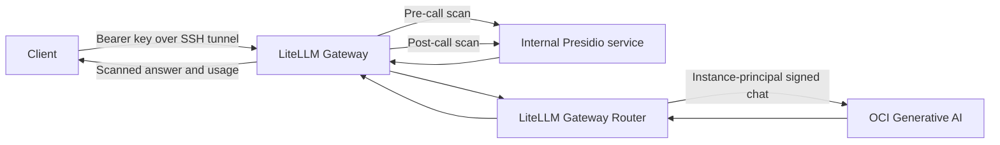

# Product requirements: OCI Generative AI gateway with LiteLLM

**Status:** implementation specification for the reference architecture  
**Audience:** OCI customers, platform engineers, and coding agents building an equivalent deployment  
**Source of truth:** this document defines the required behavior; the repository is a working example of one implementation.

## 1. Executive summary

Build a small, repeatable OCI reference deployment that gives applications one
OpenAI-compatible endpoint for approved OCI Generative AI models. The LiteLLM AI
Gateway must use its Gateway Router to expose two explicit model groups:
`basic` for routine, lower-cost work and `reasoning` for more demanding work.
Both groups must use the same request and response guardrail boundary. A separate
Presidio service demonstrates sensitive-text detection and masking.

An OCI customer should be able to click a **Deploy to Oracle Cloud** button,
review a Resource Manager plan, apply the stack, open an SSH tunnel, and run a
synthetic smoke test. The result is an evaluation architecture that customers
can adapt to their own model, data, identity, network, and cost requirements.

## 2. Problem, users, and outcomes

Applications that call individual models directly must each handle provider
authentication, model selection, safety checks, and usage reporting. A shared
gateway makes those decisions visible and consistent across applications.

| User | Job to be done | Successful outcome |
|---|---|---|
| OCI platform operator | Deploy and inspect a repeatable example | One Resource Manager stack creates the infrastructure, identity, gateway, and guardrail services. |
| Application developer | Call an approved model through a stable API | A bearer-authenticated chat request to `basic` or `reasoning` returns text and usage. |
| Security and privacy reviewer | Inspect where text goes and how it is transformed | Request and response scans are documented, fail closed, and testable with synthetic identifiers. |
| FinOps owner | Understand and bound evaluation spend | Model-tier choice, output caps, concurrency limits, returned usage, and OCI billing guidance are explicit. |

The primary success measure is a fresh button deployment that passes the
synthetic end-to-end test for both model groups without manual VM repair.

## 3. Scope

### Required reference scope (P0)

- A single OCI Compute VM, VCN, public subnet, restricted SSH ingress, and
  outbound access needed for bootstrap and OCI inference.
- LiteLLM **Gateway Router** running as the application-facing service, with
  `basic` and `reasoning` logical model groups backed by configurable OCI
  Generative AI on-demand model IDs.
- OCI instance-principal authentication for inference. No OCI user signing key
  or gateway bearer token in Terraform state or the source package.
- A separate internal Presidio analyzer/anonymizer service used by a default-on
  LiteLLM guardrail for input and output text.
- Bounded text-chat API, simple cost controls, synthetic example clients,
  automated tests, operations guidance, and a reproducible Resource Manager ZIP.
- A README Deploy to Oracle Cloud button whose `zipUrl` resolves to a published,
  downloadable ZIP with Terraform files at the archive root.

### Deliberate exclusions (P0)

No clinical workflow, real patient data, HIPAA certification, guaranteed
de-identification, public gateway endpoint, graphical UI, high availability,
multi-tenant identity, persistent chat history, shared dollar budget, automatic
model-tier classifier, streaming, tool calls, or multimodal requests is required.
These need separate design and validation before customer production use.

### Extension backlog (P1/P2)

Document, but do not claim as deployed: private ingress, multiple Gateway
workers, PostgreSQL-backed LiteLLM virtual keys and budgets, Redis-backed
shared counters, verified model pricing, team attribution, automated tier
routing, additional guardrail services, central monitoring, and recovery across
availability domains or regions.

## 4. Customer journeys

1. **Deploy:** The operator chooses a compartment and regions, supplies an SSH
   public key and trusted IPv4 CIDR, reviews model IDs and VM sizing, then runs
   Resource Manager Apply. A successful Terraform job produces an instance ID,
   public IP, tunnel command, bootstrap check, API key retrieval command, API
   URL, and route-to-model mapping.
2. **Verify:** The operator waits for cloud-init and both container health checks,
   opens the SSH tunnel, retrieves the VM-generated key, and runs the synthetic
   smoke test. The test calls both OCI routes and checks masking and usage.
3. **Integrate:** An application sends `POST /v1/chat/completions` with an
   explicit `model` value of `basic` or `reasoning`. The Gateway validates and
   scans text, routes to OCI, scans the result, and returns a normalized answer.
4. **Operate:** The operator can inspect systemd and container health, diagnose
   bootstrap or IAM propagation failures, compare usage with OCI billing, and
   destroy the stack when evaluation ends.

## 5. Architecture and trust boundaries

The gateway must bind to VM loopback. Only TCP 22 from the supplied trusted
CIDR is reachable from outside the VM. Presidio must be reachable only on an
internal container network. The gateway VM is the OCI workload identity; an
exact-instance dynamic group and chat-only IAM policy authorize inference in
the selected compartment. IAM resources are created in the tenancy home region.

The selected model and OCI offering determine where inference is processed.
Customers must verify model availability, hosting terms, processing location,
pricing, and organizational approval before sending any approved workload.
Use synthetic data for reference validation.

## 6. Functional requirements and acceptance criteria

### FR-01 — Deployable OCI package

- Terraform and `schema.yaml` must provide a Resource Manager form for tenancy,
  deployment compartment and region, GenAI compartment and region, SSH public
  key and trusted CIDR, model IDs, availability domain, VM size, and image.
- The default VM profile is an Ubuntu 24.04 AMD flexible shape with at least
  1 OCPU, 16 GB RAM, and a 50 GB boot volume. Validate image/shape compatibility
  before launch.
- Include all bootstrap application source in an explicit manifest. Keep local
  credentials, `.env` files, state, caches, and hard-coded test-tenancy values out of the ZIP
  and instance metadata. Reject a payload above OCI's metadata size limit.
- Bootstrap must install its runtime with bounded retries for temporary package
  mirror or DNS failures, create a systemd-managed Compose workload, and wait
  for healthy containers. Source/configuration changes must replace the
  stateless VM rather than appear applied while leaving old code running.
- The ZIP build must be reproducible; its checksum must be published. The
  README button must use Oracle's `zipUrl` format and point to a hosted ZIP that
  downloads successfully. Document expiration and renewal if the link is a
  time-limited Object Storage PAR.

**Pass when:** a fresh Resource Manager Apply completes, cloud-init reports
`done`, both containers are healthy, and the button's downloaded ZIP matches
the published checksum. Apply alone is not proof the application is ready.

### FR-02 — OCI identity and inference

- The gateway must obtain and refresh an OCI instance-principal signer and use
  it for OCI Generative AI chat requests. The implementation must work with the
  pinned LiteLLM and OCI SDK versions, including request parameter copying.
- Grant only `use generative-ai-chat` to a dynamic group matching the deployed
  instance. Do not grant model or cluster management permissions.
- The operator may select distinct deployment and inference compartments and
  regions. Model IDs must be configurable; defaults are examples only.
- Fail with a clear, non-sensitive error when workload identity or model access
  is unavailable. Allow for IAM propagation delay in the deployment guide.

**Pass when:** both model groups return real OCI inference using the VM's
instance principal, with no OCI user API key on the VM.

### FR-03 — LiteLLM Gateway Router

- Run the LiteLLM Gateway process and configure actual Router model groups
  named `basic` and `reasoning`. Do not substitute a custom proxy that merely
  calls the LiteLLM SDK.
- Each group must map to an OCI on-demand model. The reference defaults are
  `google.gemini-2.5-flash-lite` and `xai.grok-4.3`; verify current availability
  in the selected region and replace these IDs when necessary.
- Require callers to specify one of the two groups. Do not silently select or
  escalate a tier. Keep group definitions extensible so an additional approved
  OCI deployment can later be added behind the same group.
- Expose authenticated `GET /v1/models`, `POST /v1/chat/completions`, and a
  liveliness endpoint. Missing bearer authorization must fail.

**Pass when:** discovery returns `basic` and `reasoning`, both aliases reach
their configured OCI models, and an unknown or missing alias is rejected.

### FR-04 — Bounded text-chat contract

- Accept only non-streaming, single-choice messages with `system`, `user`, or
  `assistant` roles and non-empty string content. Set a bound of 100 messages
  and 50,000 total input characters.
- Reject tool/function calls, audio, image or other multimodal content,
  caller-supplied provider URLs or keys, caller-selected guardrails, and fields
  that could bypass text inspection. Errors must not echo submitted content.
- Default and maximum output caps are 512 tokens for `basic` and 4,096 for
  `reasoning`; callers may request a smaller positive limit.
- Remove reasoning traces, tool calls, audio fields, and other unscanned output
  surfaces from successful responses. Reject unsupported response shapes.

**Pass when:** boundary and bypass tests reject invalid requests before OCI
inference, and only scanned text is present in the returned message.

### FR-05 — Presidio guardrail service

- Build a separate English-text service using Presidio Analyzer and Anonymizer.
  It must expose LiteLLM-compatible `/analyze` and `/anonymize` operations, an
  internal health endpoint, and deterministic typed replacements such as
  `<EMAIL_ADDRESS>`, `<MRN>`, and `<DATE_OF_BIRTH>`.
- Use built-in entity detection plus small, labeled examples for medical record,
  patient, account, and date-of-birth values. Document that recognizers are
  illustrative and must be evaluated against customer formats.
- Configure LiteLLM's Presidio guardrail as default-on for both requests and
  responses. The client must not be able to disable or replace it.
- Invalid offsets, malformed guardrail replies, analyzer failures, and service
  outages must stop the request. Do not return original text in these errors.
- Set size and concurrency bounds; keep the NLP model inside the image so it is
  available without a runtime download.

**Pass when:** synthetic email, MRN, and DOB values are absent from both model
responses; a stopped guardrail causes a failed request; raw values do not
appear in service errors or container logs.

### FR-06 — Usage and cost behavior

- Return the provider usage object when OCI supplies it. Do not turn token
  counts into a claimed OCI invoice amount.
- Cap concurrent model requests at four, reject an excess request instead of
  building an unbounded queue, disable automatic retries, and disable response
  caching for this reference.
- Provide a small example client that prefers `basic`, permits explicit
  `reasoning` calls, caps output, and can keep aggregate counts without storing
  prompts or responses.
- Explain how a future stateful LiteLLM Gateway can add virtual keys, team
  attribution, rate limits, spend records, and budgets. State clearly that this
  database-free deployment has no shared or hard dollar budget. OCI billing is
  the source of truth for invoiced cost; OCI Budgets provide alerts.

**Pass when:** a response includes usage when provided by OCI, request limits
are tested, and documentation makes no claim of enforced dollar ceilings.

### FR-07 — Operator experience and documentation

- README must give a customer-facing summary, architecture, benefits, deploy
  button, setup steps, tunnel/key commands, a sample API call, test command,
  billing notice, limitations, and links to detailed guides.
- Documentation must cover IAM, regional model choice, guardrails, routing,
  usage/cost limits, bootstrap diagnostics, cleanup, and production extensions.
- Provide a standard-library synthetic smoke script that uses a local gateway
  URL and bearer key and calls both groups. A graphical UI is optional.

**Pass when:** a new operator can deploy and run the smoke test by following
the README and Resource Manager outputs without editing application code.

## 7. Nonfunctional requirements

| Area | Requirement |
|---|---|
| Secret handling | Generate a random `sk-` Gateway master key on the VM in a root-owned `0600` file. Never include it in Terraform state, metadata, ZIP, Git, logs, or sample output. |
| Network | Only SSH from `/24` or narrower trusted IPv4 CIDR is public; gateway listens on loopback; Presidio has no public listener. |
| Privacy | No raw request/response logging, persistent prompt store, reversible redaction map, or response cache in the reference. Disable verbose errors and telemetry where supported. |
| Isolation | Run both containers as non-root with read-only filesystems, dropped capabilities, health checks, restart policy, and bounded local logs. |
| Recoverability | Runtime package installation retries; systemd restarts failed container startup. Provide commands for manual recovery and full stack destruction. |
| Versioning | Pin and test the LiteLLM, OCI SDK, Presidio, spaCy, and container dependencies. Revalidate callback and guardrail contracts when upgrading. The current example pins LiteLLM 1.103.0 and Presidio 2.2.364; those are a tested baseline, not a promise that they remain latest. |
| Portability | No tenancy-specific IDs, IP addresses, private keys, or customer data in tracked source or released package. |

## 8. Repository deliverables

| Deliverable | Expected implementation location |
|---|---|
| OCI infrastructure and outputs | `*.tf`, `schema.yaml` |
| Cloud-init and service startup | `deploy/cloud-init.yaml.tftpl` |
| Gateway Router, callback, image | `gateway/config.yaml`, `gateway/oci_auth.py`, `gateway/Dockerfile` |
| Guardrail API, recognizers, image | `guardrail/app.py`, `guardrail/recognizers.py`, `guardrail/Dockerfile` |
| Service wiring | `compose.yaml` |
| Package and button generator | `scripts/package.py` |
| Example clients | `examples/smoke_test.py`, `examples/cost_controlled_chat.py` |
| Verification | `tests/`, `.github/workflows/validate.yml`, `docs/validation.md` |
| Customer guides | `README.md`, `docs/deployment.md`, `docs/reference-architecture.md`, `docs/litellm-routing-and-cost.md` |

## 9. Build sequence for a coding agent

1. **Establish the contract.** Read this PRD and the linked architecture guide.
   Choose a compatible, pinned dependency set. Verify current OCI model IDs,
   regional availability, LiteLLM config fields, and Resource Manager schema
   before changing implementation. Record any deviations from this baseline.
2. **Implement and test the guardrail.** Create the Presidio HTTP contract,
   recognizers, overlap handling, typed replacements, privacy-safe errors,
   and health check. Test real analyzer behavior with synthetic text.
3. **Implement and test the Gateway.** Configure the actual LiteLLM Router,
   instance-principal signer, pre-call bounds, Presidio integration, and output
   filtering. Test authentication, every supported alias, rejection paths,
   signer refresh, and a stopped guardrail.
4. **Package the workload.** Build non-root images and Compose networking.
   Ensure only the gateway is published on loopback and both containers reach
   healthy state with synthetic environment settings.
5. **Build OCI infrastructure.** Add validated Terraform inputs, exact-instance
   IAM, network, VM, compressed cloud-init, retrying runtime install, and useful
   outputs. Check Terraform format and validation.
6. **Publish the Resource Manager source.** Build a deterministic, allowlisted
   ZIP with Terraform at the root. Test ZIP integrity, checksum, and absence of
   secrets. Publish it at a stable HTTPS URL and generate the README `zipUrl`
   button from that exact URL.
7. **Validate on OCI.** In an isolated compartment, use the button to create a
   fresh stack. Confirm Resource Manager Apply, cloud-init, containers, tunnel,
   authenticated routes, two real OCI calls, synthetic redaction, usage, and
   cleanup. Record model IDs, region, versions, and outcomes without publishing
   credentials or real identifiers.

The agent should complete each local verification gate before provisioning OCI.
Changes to a live stack may replace its VM, bearer key, and public IP; inspect
the Terraform plan and rerun the end-to-end test after replacement.

## 10. Verification matrix and release gate

| Gate | Required evidence |
|---|---|
| Unit and contract tests | Guardrail detects labeled synthetic identifiers, handles overlaps, rejects malformed input without echoing it, and fails closed. Gateway validates text-only bounds and protects OCI signer refresh. |
| Local Gateway test | Real LiteLLM process starts, health is available, unauthenticated model discovery returns 401, authenticated discovery lists both groups, and invalid requests are rejected. |
| Infrastructure test | `terraform fmt -check -recursive`, `terraform init -backend=false`, and `terraform validate` pass; image/shape and metadata-size preconditions are covered. |
| Package test | Two builds have the same SHA-256; ZIP passes integrity check; Terraform and schema are at root; no state, key, token, or local settings are present. |
| Fresh OCI test | Button downloads the published ZIP, Apply finishes, cloud-init is `done`, systemd is active, and both containers are healthy. |
| End-to-end test | Through an SSH tunnel, `/v1/models` lists both groups; `basic` and `reasoning` return non-empty text and usage; synthetic email/MRN/DOB are absent; no reasoning/tool/audio fields leak. |
| Failure test | Missing bearer key fails; unsupported inputs fail; guardrail outage stops a request; neither errors nor logs reveal submitted synthetic identifiers. |
| Documentation review | A reader can deploy, test, troubleshoot, and destroy the stack; cost and privacy limitations are explicit; all URLs and model defaults are current for the release. |

The project is done when every P0 gate passes on a fresh deployment. Automated
tests alone are insufficient because IAM, OCI model availability, bootstrap,
and the Deploy button are integration points.

## 11. Risks and decisions to revisit

| Risk | Mitigation or required customer decision |
|---|---|
| Model catalog, pricing, and terms change | Keep model IDs configurable; verify the chosen OCI region and provider terms at deployment time. |
| Presidio misses or over-redacts identifiers | Use approved representative evaluation data, tune recognizers, measure errors, and add human or workflow controls where required. |
| IAM propagation delays inference | Retry the synthetic test after policy creation and use narrow IAM diagnostics. |
| Package mirrors or DNS fail at first boot | Retry installation with a bound and document recovery commands. |
| Single VM fails or is replaced | Treat the reference as stateless; decide on high availability, key rotation, and private ingress for production. |
| Gateway usage differs from billed cost | Reconcile LiteLLM usage with OCI Cost Analysis and invoices; do not infer hard dollar limits from token counts. |
| Hosted ZIP link expires or changes | Publish a versioned release artifact or customer-owned object and verify the README button at each release. |

## 12. Handoff prompt

Give a coding agent this repository and the following instruction:

> Implement or adapt the OCI Generative AI LiteLLM reference architecture in
> `docs/PRD.md`. Treat every P0 requirement and verification gate as required.
> Keep tenancy identifiers, keys, and patient data out of source and tests. Use
> the real LiteLLM Gateway Router and a separate Presidio guardrail. Verify
> current upstream compatibility, pin dependencies, run local tests and
> Terraform validation, then produce a reproducible Resource Manager ZIP and
> working Deploy to Oracle Cloud button. Report the exact deployed behavior,
> test evidence, and any unmet requirement. Use synthetic data for cloud tests.

For an existing deployment's specific implementation and operational commands,
see the [architecture](reference-architecture.md), [routing and cost guide](litellm-routing-and-cost.md),
and [deployment guide](deployment.md).
