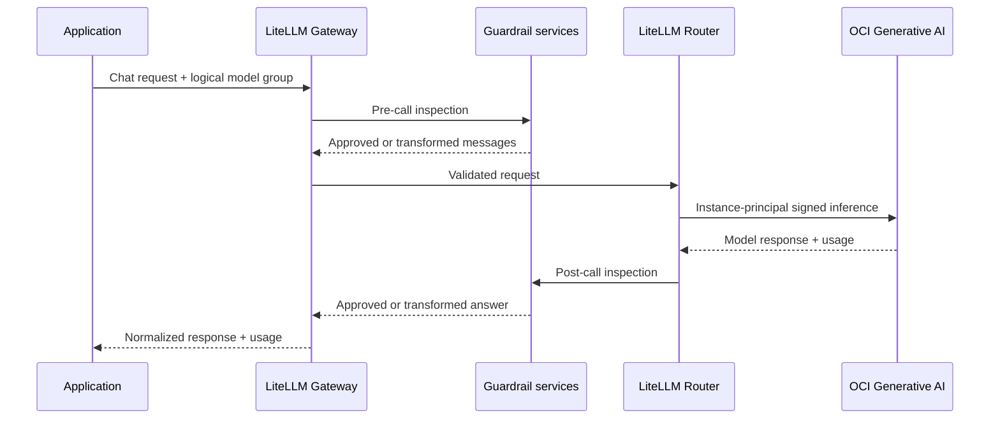

# OCI Generative AI gateway reference architecture

This reference architecture shows how an organization can place LiteLLM between
its applications and OCI Generative AI to create a shared model-access layer.
The gateway gives application teams a stable API while platform teams manage
model choice, routing, usage, and guardrails in one place.

## Architecture goals

The design addresses six common enterprise needs:

1. Give applications one supported API instead of a provider-specific
   integration for every model.
2. Publish a curated model catalog with clear cost and capability tiers.
3. Authenticate model access with OCI workload identity instead of user keys.
4. Run customer-approved policy services before and after inference.
5. Make usage and cost controls part of the shared gateway design.
6. Keep the first deployment small while preserving a path to a resilient,
   multi-team platform.

## Logical components

| Component | Responsibility | Included implementation |
|---|---|---|
| Applications | Send OpenAI-compatible chat requests using approved logical model names | Synthetic smoke test and cost-aware example client |
| LiteLLM AI Gateway | Authenticate clients, validate requests, invoke guardrails, normalize responses, and return usage | Database-free LiteLLM Gateway on OCI Compute |
| LiteLLM Gateway Router | Map logical model groups to one or more OCI Generative AI deployments | `basic` and `reasoning` groups |
| Guardrail services | Inspect, reject, annotate, or transform requests and responses | Internal Presidio analyzer and anonymizer |
| OCI IAM | Authorize the gateway workload to call approved OCI services | Exact-instance dynamic group and chat-only policy |
| OCI Generative AI | Run managed inference for the selected on-demand model | Configurable lower-cost and frontier model IDs |
| OCI operations | Deploy infrastructure and provide cloud cost reporting | Resource Manager, Terraform, compartments, Cost Analysis, and Budgets |

## Request and policy flow

The current callback restricts the public API to bounded text chat. This keeps
the demonstration's policy surface easy to understand: every accepted message
is eligible for the same pre-call scan, and the returned text passes through the
post-call guardrail. Tools, streaming, attachments, and multimodal input require
their own policy and validation design before they are enabled.

## What OCI contributes

OCI supplies the cloud control and model execution layers around LiteLLM:

- **Managed model inference:** applications do not deploy or operate the model
  runtime for OCI Generative AI on-demand models.
- **Workload identity:** the gateway uses an instance principal, so the runtime
  does not need an OCI user signing key.
- **Compartment-aware authorization:** the policy grants only Generative AI chat
  access in the selected compartment or tenancy scope.
- **Regional choice:** the VM and Generative AI endpoint can use separately
  selected supported regions when a customer's processing design requires it.
- **Repeatable deployment:** Resource Manager packages infrastructure,
  configuration, and bootstrap source into a reviewable stack.
- **Cloud financial governance:** OCI billing, Cost Analysis, tags, compartments,
  and Budget alerts complement the controls at the LiteLLM layer.

The selected model determines hosting terms and processing location. Some models
offered through OCI Generative AI are externally hosted. Customers should review
the model card, service terms, location, access requirements, and pricing for
each approved workload.

## What LiteLLM contributes

LiteLLM separates application integration from provider and model decisions:

- an OpenAI-compatible gateway endpoint;
- stable model groups across one or more provider deployments;
- routing based on availability, load, latency, usage, or configured cost;
- pre-call checks, cooldowns, retries, fallbacks, and session affinity;
- callbacks and guardrail integration around the inference path;
- normalized usage data; and
- an upgrade path to virtual keys, teams, rate limits, budgets, and spend
  tracking in a stateful Gateway deployment.

This reference enables the smallest useful subset. It uses one deployment per
group, explicit tier choice, no retry, no cache, bounded concurrency, and no
persistent spend database. That makes behavior visible during evaluation and
avoids presenting an estimate as an enforced enterprise budget.

## Guardrail service pattern

Presidio is the included example, not a fixed requirement of the architecture.
It runs as an internal service with standard analyze and anonymize operations.
LiteLLM calls it before the Router and after the model, and a service failure
blocks the request.

Organizations can extend the same boundary with independently managed services:

| Guardrail type | Example purpose |
|---|---|
| Sensitive-data inspection | Detect or transform personal, financial, account, or domain identifiers |
| Content policy | Reject disallowed categories or require review |
| Prompt security | Detect injection patterns or unauthorized instruction changes |
| Access policy | Select models or tools allowed for a team, application, or data class |
| Output validation | Enforce schemas, citations, grounded fields, or application constraints |
| Human review | Hold selected requests or responses for an approved workflow |

For production, define whether each guardrail may redact, reject, annotate, or
route a request. Also define timeouts, failure behavior, policy versions,
observability, data retention, and how changes are tested. A single generic
"safe" result is rarely enough for every application or data class.

## Routing and cost evolution

The two model groups demonstrate a common cost pattern: make the economical tier
easy to use and require an explicit decision for the frontier tier.

| Stage | Routing | Cost management |
|---|---|---|
| This reference | Caller selects `basic` or `reasoning`; one OCI deployment per group | Output and concurrency caps, no retry/cache, returned usage, aggregate example ledger |
| Shared team gateway | Several deployments per group with health/load routing and bounded fallback | Virtual keys, per-model RPM/TPM, team attribution, configured prices, spend database |
| Enterprise service | Evaluated Auto Router or customer policy chooses an approved tier | Team/customer budgets, approval workflows, reporting, reconciliation with OCI billing |

Cost-based routing requires accurate model prices in LiteLLM. OCI's billed unit
and LiteLLM's token usage can differ, so OCI remains the source of truth for the
invoice. Platform teams should measure the quality, latency, and actual billed
cost of each routing policy rather than assuming every request belongs on the
least expensive model.

## Reference and production profiles

| Area | Reference deployment | Typical production decision |
|---|---|---|
| Availability | One VM | Multiple workers, health-based ingress, zonal or regional recovery |
| Network | Public VM with SSH restricted to a trusted CIDR; Gateway on loopback | Private subnets, approved ingress, service gateways, controlled egress |
| Gateway identity | One VM-generated master key | Enterprise identity, virtual keys, service-to-service authentication, rotation |
| State | No application database | PostgreSQL for LiteLLM configuration/spend and Redis for shared counters where required |
| Guardrails | One internal Presidio service | Versioned customer policy services with monitoring and scale targets |
| Observability | Container health and synthetic validation | Central metrics, traces, audit events, alerts, SLOs, and privacy-aware logs |
| Data governance | English synthetic test data | Approved data classes, retention rules, provider/location review, measured guardrail quality |

## Customer design decisions

Before promoting the reference, decide:

- which OCI models and regions are approved for each data class;
- which application identities may use each model tier;
- when a request can escalate to a frontier model;
- which guardrails run, in what order, and whether they redact or reject;
- which usage data may be retained and who can see it;
- how LiteLLM estimates reconcile with OCI billing;
- whether spend limits must fail closed;
- how the Gateway and guardrails meet availability and latency objectives; and
- how policy, model, and dependency changes are validated and rolled back.

The [deployment guide](deployment.md) covers the included OCI stack. The
[routing and cost guide](litellm-routing-and-cost.md) describes LiteLLM options,
and the [validation record](validation.md) documents the tested behavior.
